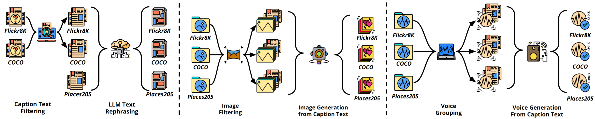
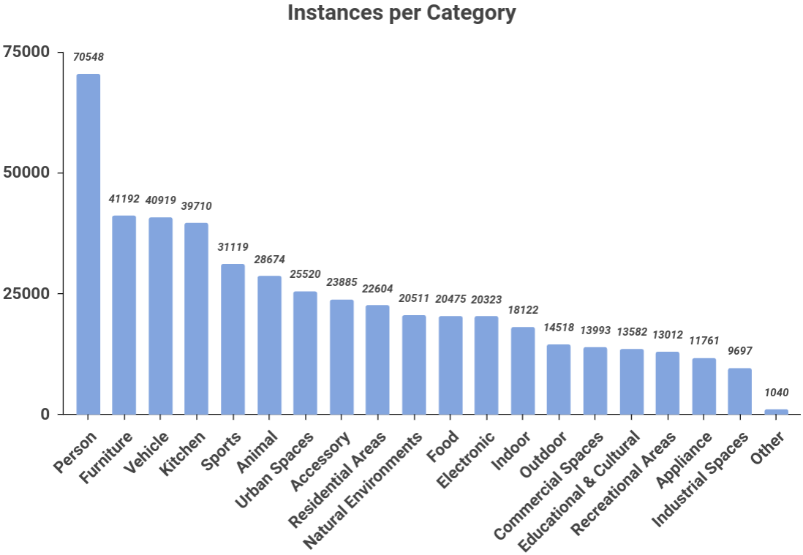

# RU-AI: A Large Multimodal Dataset for Machine-Generated Content Detection

<!-- Hugging Face Dataset Badge -->
[](https://huggingface.co/datasets/zzha6204/RU-AI-noise) [](https://zenodo.org/records/11406538) [](https://arxiv.org/abs/2406.04906) [](https://creativecommons.org/licenses/by/4.0/)


# 📰 News
**[Great News] 🎉🎉🎉 Our paper has been accpected by WWW'25 Resource Track**

This is the official repo for paper: [RU-AI: A Large Multimodal Dataset for Machine Generated Content Detection](https://arxiv.org/abs/2406.04906)

# Intorduction
The dataset is publicly avaliable at zenodo: 
```url
https://zenodo.org/records/11406538
```

The noise augmented dataset is publicly avaliable at Huggingface: 
```url
https://huggingface.co/datasets/zzha6204/RU-AI-noise
```



## Dataset Comparison
| **Dataset**                | **Modality**         | **Content**       | **Real/Human** | **Machine Generated Content** | **Task**                            |
|----------------------------|----------------------|-------------------|---------------|-------------------------------|-------------------------------------|
| M4                         | Text                | General           | 10,019,311    | 122,481                       | Multi-lingual AI Text Detection     |
| DeepfakeTextDetect         | Text                | General           | 447,674       | 447,674                       | Generalised AI Text Detection       |
| ArguGPT                    | Text                | Essay             | 4,115         | 4,038                         | Language Learner-AI Text Detection  |
| HC3                        | Text                | Question Answers  | 80,805        | 44,425                        | AI Answer Detection                 |
| CNNSpot                    | Image               | General           | 362,000       | 362,000                       | AI Image Detection                  |
| DE-FAKE                    | Image               | General           | 20,000        | 191,946                       | AI Image Detection                  |
| GenImage                   | Image               | General           | 1,331,167     | 1,350,000                     | AI Image Detection                  |
| WaveFake                   | Voice               | General           | 13,600        | 104,885                       | Fake Voice Detection                |
| Sprocket-VC                | Voice               | General           | 3,132         | 3,456                         | Fake Voice Detection                |
| FakeAVCeleb                | Video-Voice         | Face              | 500           | 19,500                        | DeepFake Detection                  |
| ForgeryNet                 | Video-Image         | Face              | 1,438,201     | 1,457,861                     | DeepFake Detection                  |
| DFDC                       | Video-Image-Voice   | Face              | 23,654        | 104,500                       | DeepFake Detection                  |
| DGM4                       | Text-Image          | General           | 77,426        | 152,574                       | Media Manipulation Detection        |
| **Ours**                   | **Text-Image-Voice**    | **General**           | **245,895**       | **1,229,475**                       | **AI Text Image Voice Detection**       |


## Requirement

The dataset requires at least 500GB of disk space to be fully downloaded. 

The model inference requires a Nvidia GPU with at least 16GB of vRAM to run. We recommend to have **NVIDIA RTX 3090, 24GB or anything above** to run this project.

We highly recommend to have this package installed within a **virtual environment** such as **[conda](https://conda.io/projects/conda/en/latest/user-guide/install/index.html)** or **[venv](https://docs.python.org/3/library/venv.html)**.

Environmental requirement:
- Python >= 3.8
- Pytorch >= 1.13.1
- CUDA Version >= 11.6

Clone the project:
```bash
git clone https://github.com/ZhihaoZhang97/RU-AI.git
```
Create the virtual environment via conda and Python 3.8:
```bash
conda create -n ruai python=3.8
```
Activate the environment:
```bash
conda activate ruai
```
Move into the project path:
```bash
cd RU-AI
```
Install the dependencies:
```bash
pip3 install -r requirements.txt
```

## Data Sample
We provide a quick tutorial on how to download and inspect the dataset on the ```data-example.ipynb``` notebook. 

You can also directly run the follwoing code to download smaple data sourced for flickr8k:
```bash
python ./download_flickr.py
```
You can also download all the data by running the following code.

Please note the whole dataset **is over 157GB** in compression and could take **up to 500GB** after decompression. 

It will take a while for downloading, the actual speed depends on your internet.
```bash
python ./download_all.py
```

You can also go to ```./data``` to manually check the data after downloading.

Here is the directory tree after downloading all the data:

```
├── audio
│   ├── coco
│   │   ├── efficientspeech
│   │   ├── real
│   │   ├── styletts2
│   │   ├── vits
│   │   ├── xtts2
│   │   └── yourtts
│   ├── flickr8k
│   │   ├── efficientspeech
│   │   ├── real
│   │   ├── styletts2
│   │   ├── vits
│   │   ├── xtts2
│   │   └── yourtts
│   └── place
│       ├── efficientspeech
│       ├── real
│       ├── styletts2
│       ├── vits
│       ├── xtts2
│       └── yourtts
├── image
│   ├── coco
│   │   ├── real
│   │   ├── stable-diffusion-images-absolutereality-remove-black
│   │   ├── stable-diffusion-images-epicrealism-remove-black
│   │   ├── stable-diffusion-images-v1-5
│   │   ├── stable-diffusion-images-v6-0-remove-black
│   │   └── stable-diffusion-images-xl-v3-0-remove-black
│   ├── flickr8k
│   │   ├── real
│   │   ├── stable-diffusion-images-absolutereality
│   │   ├── stable-diffusion-images-epicrealism
│   │   ├── stable-diffusion-images-v1-5
│   │   ├── stable-diffusion-images-v6-0
│   │   └── stable-diffusion-images-xl-v3-0
│   └── place
│       ├── real
│       ├── stable-diffusion-images-absolutereality-remove-black
│       ├── stable-diffusion-images-epicrealism-remove-black
│       ├── stable-diffusion-images-v1-5
│       ├── stable-diffusion-images-v6-0-remove-black
│       └── stable-diffusion-images-xl-v3-0-remove-black
└── text
    ├── coco
    ├── flickr8k
    └── place
```

## Object Categories



## Model Inference

Before model inference, replace image_data_paths, audio_data_paths, text_data in the `infer_imagebind_model.py` and `infer_languagebind_model.py` files with real data / data paths

imagebind based model
```bash
python infer_imagebind_model.py
```

languagebind based model
```bash
python infer_languagebind_model.py
```

## Reference
We are appreciated the open-source community for the datasets and the models. 

[Microsoft COCO: Common Objects in Context](https://arxiv.org/abs/1405.0312)

[Framing Image Description as a Ranking Task: Data, Models and Evaluation Metrics ](https://www.jair.org/index.php/jair/article/view/10833)

[Learning Deep Features for Scene Recognition using Places Database](https://papers.nips.cc/paper_files/paper/2014/hash/3fe94a002317b5f9259f82690aeea4cd-Abstract.html)

[Text-Free Image-to-Speech Synthesis Using Learned Segmental Units](https://arxiv.org/abs/2012.15454)

[Unsupervised Learning of Spoken Language with Visual Context](https://papers.nips.cc/paper_files/paper/2016/hash/82b8a3434904411a9fdc43ca87cee70c-Abstract.html)

[Learning Word-Like Units from Joint Audio-Visual Analysis](https://aclanthology.org/P17-1047/)

[LanguageBind: Extending Video-Language Pretraining to N-modality by Language-based Semantic Alignment](https://arxiv.org/abs/2310.01852)

[ImageBind: One Embedding Space To Bind Them All](https://openaccess.thecvf.com/content/CVPR2023/papers/Girdhar_ImageBind_One_Embedding_Space_To_Bind_Them_All_CVPR_2023_paper.pdf)

## Citation
If found our dataset or research useful, please cite:
```text
@misc{huang2024ruai,
      title={RU-AI: A Large Multimodal Dataset for Machine Generated Content Detection}, 
      author={Liting Huang and Zhihao Zhang and Yiran Zhang and Xiyue Zhou and Shoujin Wang},
      year={2024},
      eprint={2406.04906},
      archivePrefix={arXiv},
      primaryClass={cs.CV}
}
```
